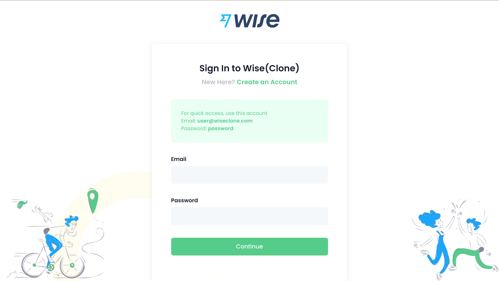

#  Wise Flask (MVP)

This project was created based on the need to have hands-on experience in creating web applications from scratch. The challenge is to create a web app where users can send virtual money in the currencies of their choice (USD, EUR, or their local currency) to each other.

## About Wise Flask (MVP)

[Wise](https://www.wise.com) allows you to transfer money abroad easily and quickly with low-cost money transfers. You can send money at the real exchange rate with no hidden fees. This web application features the following:

1. A login page.
2. A registration page.
3. A dashboard page, where transactions will be listed.
4. A transaction page.
5. API integration to get current exchange rate from [Free Currency Converter API](https://www.currencyconverterapi.com/) or any other free currency converter or a hand-coded list of exchange rates.
6. A method to record failed transactions.
7. A button to refund dollar account.

## Features
- Money can be sent (converted) into any of the three currencies to be sent to another user.
- Money can be sent/converted to any and every user who is registered on the app.
- The user to send the money to can be chosen from an input-dropdown list which shows all users if clicked on. (Tip: Create at least two users as a seed.)
- A user cannot have a negative balance. All users start with 1000 USD worth of money given via an initial transaction when you create them.
- All users start with USD as their native currency but can receive EUR and your specified local currency.
- All database tables must have the `created_at` timestamp, which should be populated automatically.

## TODO's

- A user can register with his name, email address, and password.
- A user can log in with his email address and password, which is encrypted using a good encryption system (we've been taught some encryption techniques).
- You don’t need to implement it to reset a password. The Registration and Login pages are enough.
- When a user successfully logs in, he/she sees a page with all of his transactions, including the initial transaction from the registration (1000 USD).
- The page with all the transactions also shows the current balance for each currency. (e.g., start: 1000 USD, 0 EUR, 0 NGN).
- A user can create a new transaction on a new transaction page.
- A transaction consists of the sender and the receiver, the source currency, target currency, exchange rate, and the amount.
- A user can select the target currency.
- Check if a transaction is possible, by validating if the user has enough funds in his/her selected source currency.

`Example: User A sends to User B 100 EUR. But User B wants to receive that in USD. Therefore, User A has -100EUR after that transaction and User B 113 USD, depending on the exchange rate. `

## Languages

* HTML5 
* CSS
* Bootstrap 4
* JavaScript/jQuery
* Python
* Flask
* PostgreSQL

## Wise Flask (MVP) Application Development Procedures

List the appropriate steps to successfully run this application on a local environment.

## Project Final Result Screenshots
Link to the online [Demo](http://wiseclone.edgemep.com.ng)

